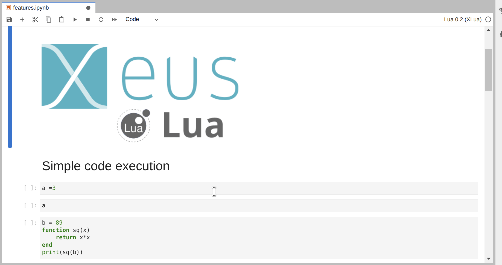
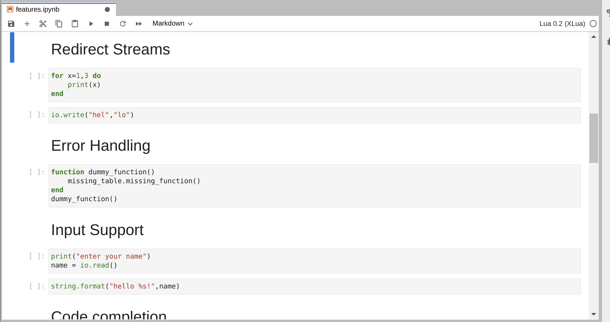
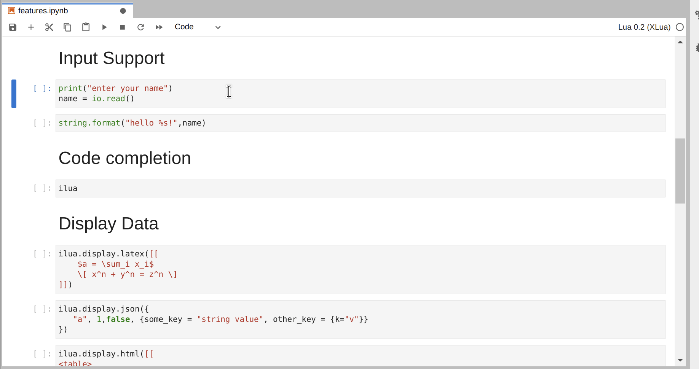
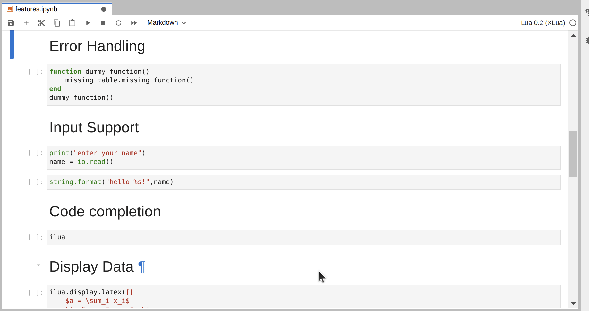
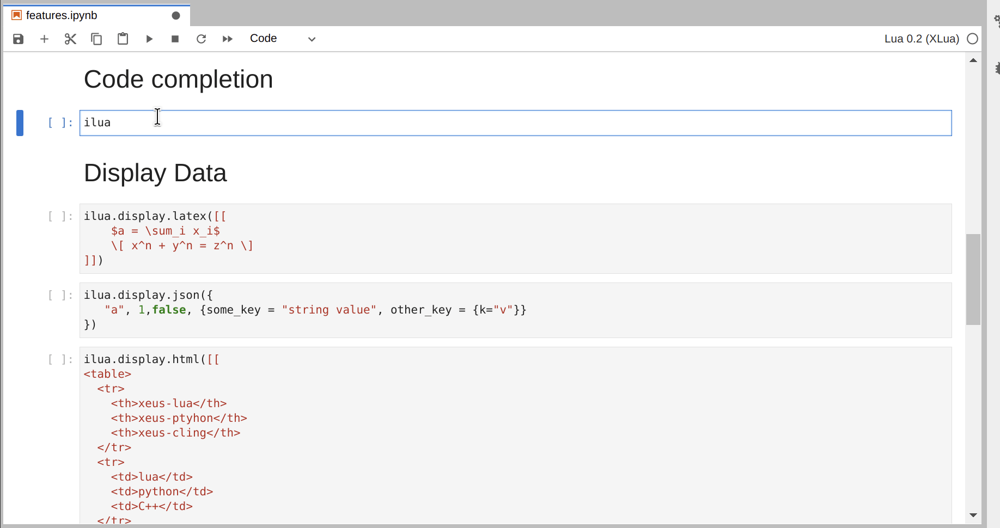
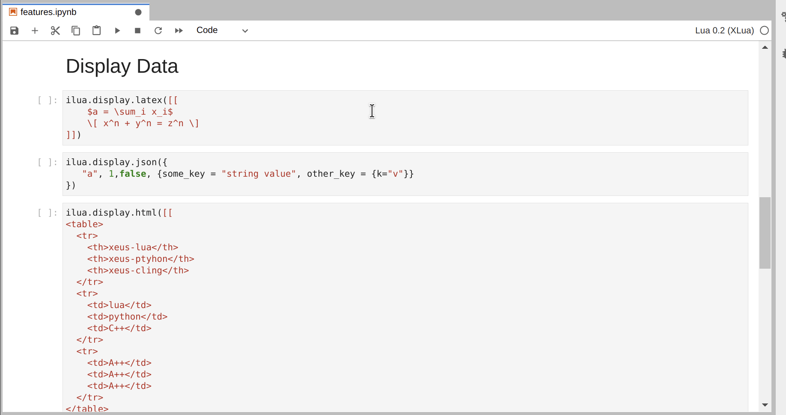
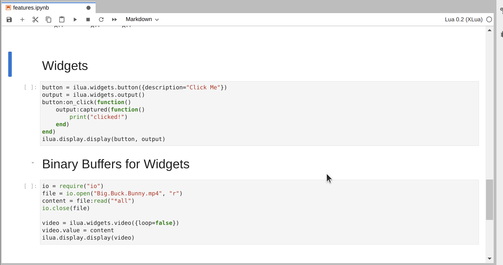

# 

[](https://github.com/jupyter-xeus/xeus-lua/actions/workflows/main.yml)
[](https://xeus-lua.readthedocs.io/en/latest/?badge=latest)
[](https://mybinder.org/v2/gh/jupyter-xeus/xeus-lua/main?urlpath=/lab/tree/notebooks/game_of_life.ipynb)
[](https://gitter.im/QuantStack/Lobby?utm_source=badge&utm_medium=badge&utm_campaign=pr-badge&utm_content=badge)

`xeus-lua` is a Jupyter kernel for Lua based on the native implementation of the
Jupyter protocol [xeus](https://github.com/jupyter-xeus/xeus).

## Installation

xeus-lua has  been packaged for the mamba (or conda) package manager.
To ensure that the installation works, it is preferable to install `xeus-lua` in a
fresh environment. It is also needed to use a
[miniforge](https://github.com/conda-forge/miniforge#mambaforge) or
[miniconda](https://conda.io/miniconda.html) installation because with the full
[anaconda](https://www.anaconda.com/) you may have a conflict with the `zeromq` library
which is already installed in the anaconda distribution.

The safest usage is to create an environment named `xeus-lua`

```bash
mamba create -n xeus-lua
source activate xeus-lua
```

### Installing from conda-forge

Then you can install in this environment `xeus-lua` and its dependencies

```bash
mamba install xeus-lua jupyterlab -c conda-forge
```

### Installing from source

Or you can install it from the sources, you will first need to install dependencies

```bash
mamba install cmake xeus xwidgets nlohmann_json cppzmq xtl lua  jupyterlab -c conda-forge
```

Then you can compile the sources (replace `$CONDA_PREFIX` with a custom installation
prefix if need be)

```bash
mkdir build && cd build
cmake .. -D CMAKE_PREFIX_PATH=$CONDA_PREFIX -D CMAKE_INSTALL_PREFIX=$CONDA_PREFIX -D CMAKE_INSTALL_LIBDIR=lib
make && make install
```

## Trying it online

To try out xeus-lua interactively in your web browser, just click on the binder link:

[](https://mybinder.org/v2/gh/jupyter-xeus/xeus-lua/main?urlpath=/lab/tree/notebooks/game_of_life.ipynb)

## Usage

Launch the Jupyter notebook with `jupyter notebook` or Jupyter lab with `jupyter lab`
and launch a new Python notebook by selecting the **xlua** kernel.

**Code execution and variable display**:



**Output streams**:



**Input streams**:



**Error handling**:



**Code completion**:



**Display Data**:



**And of course widgets**:



**Binary Buffers for Widgets**:


## Documentation

To get started with using `xeus-lua`, check out the full documentation 

http://xeus-lua.readthedocs.io

## What are the advantages of using xeus-lua over other lua kernels?

There are several lua kernels available:
 
  * [lupyter](https://github.com/tomstitt/lupyter) A python based implementation of a lua
    jupyter kernel. The heavy lifiting is done in a C-extension.
  * [ILua](https://github.com/guysv/ilua): A feature rich implementation. Ilua
    is implemented in python and does the communication with Lua via IPC.
  * [IPyLua](https://github.com/pakozm/IPyLua): IPyLua is a pure Lua implementation.

While these implemetentations are feature rich and work very well, none of  the above supports interactive widgets.
Since this implementation is based on [xeus](https://github.com/jupyter-xeus/xeus), we can reuse components from
the xeus ecosystem like [xwidgets](https://github.com/jupyter-xeus/xwidgets).

## Dependencies

`xeus-lua` depends on

- [xeus](https://github.com/jupyter-xeus/xeus)
- [xtl](https://github.com/xtensor-stack/xtl)
- [xwidgets](https://github.com/jupyter-xeus/xwidgets)
- [lua](https://www.lua.org/)

| `xeus-lua`    | `xeus`        | `xwidgets`    | `xtl`        | `cppzmq` | `nlohmann_json` | `lua`        | 
| ------------- | ------------- | ------------- | ------------ | -------- | --------------- | ------------ | 
| master        | >=2.4.0,<3    | >=0.26.1      | >=0.7.0,<0.8 | ~4.4.1   | >=3.6.1,<4.0    | >=5.2.0      | 
| 0.6.2         | >=2.4.0,<3    | >=0.26.1      | >=0.7.0,<0.8 | ~4.4.1   | >=3.6.1,<4.0    | >=5.2.0      | 

## Contributing

See [CONTRIBUTING.md](./CONTRIBUTING.md) to know how to contribute and set up a
development environment.

## License

We use a shared copyright model that enables all contributors to maintain the copyright
on their contributions.

This software is licensed under the BSD-3-Clause license. See the [LICENSE](LICENSE)
file for details.
